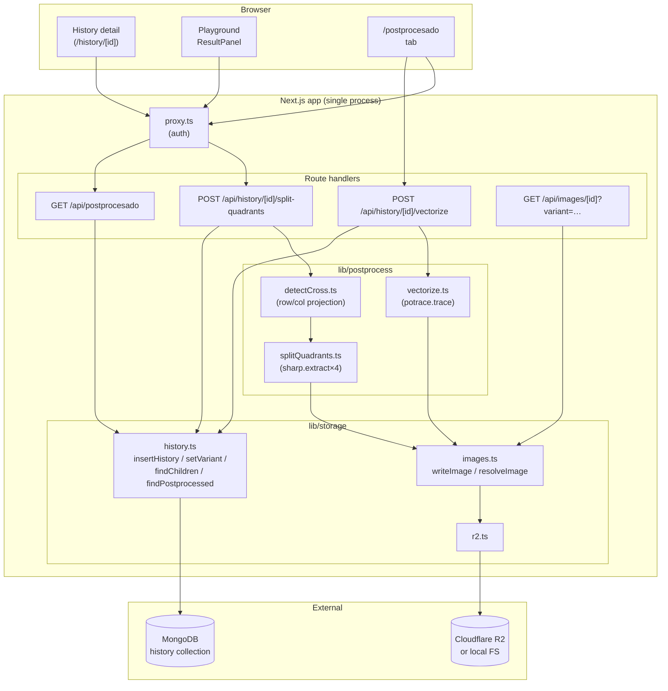

# SDD — Image post-processing (split + vectorize)

> **Status:** Draft for review. No production code has been written.
> **Author:** Claude (assisted, supervised by Miguel Jiménez).
> **Date:** 2026-05-07.
> **Scope:** Two new features — quadrant splitting of generated images and PNG→SVG vectorization — surfaced in a new "Postprocesado" tab.

---

## 0. Brief reconciliation (read first)

The original task brief refers to **Express**, **table/columns/relations**, and a **`requirements.txt`** strategy. The actual codebase is:

- **Next.js 16.2.4** (App Router, Route Handlers, Turbopack), not Express.
- **MongoDB 7 + Mongoose 8** (document store), not SQL tables.
- **Cloudflare R2** (S3-compatible) with a local-FS fallback, not "the upload helper".
- Single-process container; provider work is fully synchronous (`ARQUITECTURE.md §2` explicitly excludes background queues).

This SDD therefore designs against the real stack, mirrors existing patterns (the `transparent` variant flow in `/api/history/:id/strip-background` is the closest analogue and is referenced throughout), and treats the brief's stack words as a translation issue, not a directive. The Node-vs-Python analysis (§5) explicitly evaluates the Python option the brief asked about, and recommends Node. **No re-platforming is on the table.**

---

## 1. Executive summary

Add two post-processing operations to images that already live in the playground's history:

1. **Split-into-quadrants** — detect a near-white "cross" in an existing image (vertical + horizontal divider line, possibly off-center, possibly imperfect); cut along it; persist 4 child PNGs as first-class history rows linked to the parent.
2. **Vectorize PNG→SVG** — for any quadrant (and, optionally, any raster history image), produce an SVG via potrace, store it as a `vector` variant on that row.

All processing stays inside the existing `app` container in pure Node using **`sharp`** (already in `package.json`) and **`potrace`** (a pure-JS port; new dep, ~150 KB). No Python sidecar, no IPC, no Dockerfile change beyond the new npm dep. Quadrants and vector variants surface in a new `/postprocesado` tab that groups children under their parent and visually distinguishes the four roles: original, quadrant, vector. The existing `variants` mechanism on `History` is reused for the SVG-from-quadrant case; quadrants themselves are new history rows because they are distinct images, not alternates of the parent.

---

## 2. Context and motivation

The playground generates single images per provider call. A common follow-up workflow today is manual: download the image, open Figma/Photoshop, crop into 4 reference panels, then trace one of them in Illustrator. We want a one-click in-app shortcut for that loop.

Concrete pain points the design must address:

- **Cut location is variable.** Some providers compose 4 sub-images on a white grid; the divider lines are not always centered, sometimes slightly off-axis, sometimes 1–3 px wide, sometimes 5–10 px.
- **Falling back gracefully matters.** If the model didn't produce a divider (e.g. a single subject on a white background), splitting at 50/50 is acceptable — we don't want the button to refuse to work.
- **Quadrants need to be reusable.** A user will want to vectorize one quadrant, download another at full resolution, share a third — they need stable URLs and download flows identical to a generated image's.
- **Existing UX patterns are valuable.** The `Remove background` button on `/history/[id]` and its variant model already taught users a shape: click → server processes → side-by-side panels appear. We want the same shape for "Split" and "Vectorize".

---

## 3. Functional requirements

| # | Requirement |
|---|---|
| FR-1 | From a history detail page (`/history/[id]`) on a raster image, a user can click **"Split into 4"** to produce 4 child images. |
| FR-2 | Splitting auto-detects a white cross (one vertical + one horizontal line) and cuts along it; if either axis is not detected, falls back to 50%. |
| FR-3 | Each child is persisted as PNG, written to R2 (or FS) using the same `writeImage()` call path as a generated image, and gets its own `History` row with a `parentId` and `quadrantIndex` (0..3). |
| FR-4 | The 4 children appear in a new `/postprocesado` tab, grouped under their parent's prompt + thumbnail, in deterministic top-left → top-right → bottom-left → bottom-right order. |
| FR-5 | From a quadrant card in `/postprocesado`, a user can click **"Vectorize"** to produce an SVG. The SVG is stored as a `vector` variant on the quadrant's row (same mechanism as the existing `transparent` variant on `History.variants.transparent`). |
| FR-6 | The vector SVG is shown next to its source PNG, visually distinguished (border color + label), and downloadable via `/api/images/<quadrantId>?variant=vector`. |
| FR-7 | Re-clicking "Split" on an image that already has quadrants returns the existing 4 children (idempotent, no duplicates). Re-clicking "Vectorize" on a quadrant that already has an SVG returns the existing variant. |
| FR-8 | The Postprocesado tab is paginated newest-first, like the sidebar history. |
| FR-9 | All routes are auth-guarded (existing `proxy.ts` covers `/postprocesado`; mutating routes additionally enforce `isAllowedOrigin`). |
| FR-10 | The "Split into 4" button is also available on the Playground's `ResultPanel` directly after generation, as a convenience shortcut to the same endpoint. |

Out-of-scope for this iteration:

- Splitting into N≠4 (3×3 grids, halves, etc.).
- User-tunable thresholds in the UI (the algorithm parameters are fixed in code; they can be made configurable later).
- Vectorizing a non-quadrant image. The button initially only ships in the Postprocesado tab. Trivial to extend later.
- Rasterizing an SVG back to PNG (already implicitly out — provider call still owns the raster path).

---

## 4. Non-functional requirements

- **Latency.** Split must complete in < 2 s for a typical 1024×1024 PNG; vectorize in < 5 s for a typical quadrant (~512×512). These are budgets, not SLOs — there is one user.
- **Memory.** Sharp is the only allocator; we keep a single decoded RGBA buffer in memory at any time during the split (≤ 16 MB for a 2048² image at 4 bytes/pixel). No streaming-cropping is needed at this scale.
- **Robustness.** A failed detection must not crash the route — it falls back to 50/50. A failed potrace must surface as `{ error: "vectorize_failed" }` and leave the row untouched.
- **Idempotency.** Both operations are idempotent on the document level (re-clicking returns existing artifacts). The R2 keys are deterministic from `(parentId, quadrantIndex)` and `(quadrantId, "vector")`, so retries after a partial failure overwrite cleanly.
- **No background queues.** Both operations run inline in the route handler, mirroring `/api/generate` and `/api/history/:id/strip-background`. This matches `ARQUITECTURE.md §2`.
- **Dockerfile leanness.** Adding a Python runtime would roughly **double** the runner-stage layer size (alpine python3 ≈ 50 MB, + opencv-python-headless ≈ 100 MB, + numpy + libvips + potrace binary ≈ 80 MB). Sticking with Node keeps the runner under the current ~180 MB.
- **Observability.** Errors logged via `console.error` (captured by container stdout). On split, log `{ id, detected: { x, y } | "fallback", durationMs }`. Never log image bytes.

---

## 5. Analysis of technical alternatives — Node vs Python

### Decision: **Pure Node, in-process.** No microservice, no sidecar, no subprocess to a Python interpreter.

### 5.1 What each task actually needs

| Task | Operation | Library shape |
|---|---|---|
| Detect white cross | Read raw RGBA, sum-per-row & sum-per-column, threshold | Trivial in any language |
| Crop into 4 PNGs | `extract(left, top, w, h)` + re-encode | Provided by sharp / Pillow / OpenCV |
| Vectorize PNG → SVG | Posterize → trace contours → emit SVG paths | potrace (C, with Node + Python bindings) or imagetracerjs (pure JS, color-aware) |

None of this requires OpenCV-grade computer vision (no contour detection, no perspective correction, no ML). The white-line detection is a **1D projection problem** on a raw byte buffer — sub-100-LOC of TypeScript.

### 5.2 Option A — Pure Node (recommended)

**Libraries:**

| Lib | Already in repo? | Purpose | Size |
|---|---|---|---|
| `sharp` 0.34.5 | ✅ | Decode/encode PNG/JPG/WebP, raw RGBA buffer access, `extract()` for crops | already deployed |
| `potrace` (npm, by oliver-moran) | new | PNG → SVG trace. Pure JS port of Peter Selinger's potrace | ~150 KB unpacked |

**Pros:**

- Zero ops surface added. One process, one log stream, one healthcheck.
- Sharp is **already** doing raw-RGBA work in `src/lib/storage/convert.ts` (`stripRasterBackground`). The white-line detector reuses the same pattern.
- No IPC. The split route handler reads bytes from R2, runs sharp, writes 4 keys back, all in one async function.
- `potrace` (the npm pkg) is mature (used by a large amount of design tooling), pure JS, no native build step, works on `node:22-alpine` out of the box.
- Aligns with the existing `strip-background` precedent.

**Cons:**

- Pure-JS potrace is slower than the C original — ~2× slower in our typical-size regime (still well within budget).
- For **multicolor** vectorization, Node options are weaker (`imagetracerjs` is the main one and produces larger SVGs). For monochrome / 2-color illustrations, output is comparable.
- If we ever need *real* CV (subject segmentation, background removal that goes beyond uniform color, perspective correction), we'd revisit.

### 5.3 Option B — Python sidecar

**Shape:** a second container running FastAPI/uvicorn, exposing `POST /split` and `POST /vectorize`. Express App container shells out via internal HTTP on the `playground` Compose network.

**Hypothetical `requirements.txt`:**

```
fastapi==0.115.0
uvicorn[standard]==0.30.6
pillow==10.4.0
numpy==2.1.2
opencv-python-headless==4.10.0.84
potracer==0.0.4         # pure-Python port; the C lib is invoked via subprocess if preferred
pydantic==2.9.2
```

**Pros:**

- OpenCV is best-in-class for any future "real" CV work. If we suspected we'd need contour cleanup or perspective dewarp, this would matter.
- The Python potrace ecosystem is slightly more mature for color/banded vectorization (`vtracer` Rust binary is also an option, callable from Python or directly).

**Cons (decisive):**

- **+1 container, +1 healthcheck, +1 image to rebuild on dep bumps, +1 set of env vars**. The project's whole posture (`ARQUITECTURE.md §2`, "Single-environment, direct-to-production deployment") is to minimize moving parts.
- **Latency floor.** Even an internal HTTP call from app → python adds 5–20 ms before any work is done; cold-start for a Python interpreter holding numpy + opencv is ~600 ms. We'd have to keep the process warm = always-running second container = always-using memory.
- **Deploy footprint.** OpenCV+numpy+pillow+potrace pulls in ~250 MB of runtime; even with a slim base, the second image is bigger than the entire app today.
- **Operational asymmetry.** The team is one person who knows Node deeply. Adding a Python service trades a few ms of vectorization quality for a permanent maintenance tax.
- **Fits ill with R2 access.** The Python service would need its own R2 client + creds, doubling the secret blast radius for an internal tool.
- **The actual algorithms are trivial.** White-line detection is one for-loop over a flat RGBA buffer. Cropping is one `sharp.extract()`. Vectorization is one `potrace.trace()`. This is not the use case Python wins.

### 5.4 Option C — Subprocess to a Python script (no microservice)

Same Python deps, but the app shells out via `child_process.spawn("python", ["script.py"], …)`.

- Removes the always-on container.
- Adds **cold-start on every request** (≥ 600 ms), python+opencv import cost amortized poorly.
- Still need to bake Python + opencv into the runner image → bigger Dockerfile, slower CI.
- Same secret-handling concern (the script needs R2 creds, OR app must pipe the bytes via stdin → 10–40 MB payload over a pipe).

This is the worst of all worlds. Rejected.

### 5.5 Recommendation

**Go with Option A (pure Node).** Add `potrace` as a dep, write ~250 LOC of TypeScript across two route handlers and one `lib/postprocess/` module, no Dockerfile change beyond the npm install layer that already exists.

Revisit Python only if a future task needs genuine CV (e.g., subject-aware background removal, perspective correction, OCR), at which point the cost is justified.

### 5.6 `find skill`?

- The `find-skills` flow is for installable Claude skills, not Python libraries. There is no skill in our installed set that is meaningfully relevant to "Python image processing". Don't run a skill search for that — it would noise the codebase.
- The relevant *Claude* skills for this work are `nextjs-app-router-patterns` (for the API routes), `mongodb-schema-design` (for the History parent/child evolution), `tailwind-v4-shadcn` (for the new tab UI), and the project-pinned `simplify` and `security-review` to run before merging. These are already declared in `CLAUDE.md`.

---

## 6. Proposed design

### 6.1 Architecture



### 6.2 Data flow — split into quadrants

```mermaid
sequenceDiagram
  autonumber
  participant U as Browser
  participant API as POST /api/history/[id]/split-quadrants
  participant H as history.ts
  participant S as lib/postprocess/splitQuadrants
  participant ST as images.ts (R2/FS)
  participant DB as MongoDB

  U->>API: click "Split into 4"
  API->>API: origin check + UUID v7 validate
  API->>H: getHistory(id)
  H-->>API: parent record (or 404)
  API->>API: assert mimeType is raster (PNG/JPG/WebP); reject SVG
  API->>H: findChildren(parentId, role: "quadrant")
  H-->>API: existing 4 children?
  alt children exist
    API-->>U: { children: [...existing...], reused: true }
  else fresh
    API->>ST: readImageBytes(parent.imageFilename)
    ST-->>API: Buffer
    API->>S: detectCross + crop4(bytes, mime)
    Note over S: detectCross returns<br/>{x,y,detected:bool}
    S-->>API: 4 PNG buffers + cut metadata
    loop i = 0..3
      API->>ST: writeImage({id: childId_i, ext: "png", bytes})
      API->>DB: insertHistory({ ...child fields, parentId, parentRole:"quadrant", quadrantIndex: i })
    end
    API-->>U: { children: [{id, imageUrl, quadrantIndex}…], cut: {x,y,detected}, reused: false }
  end
```

Notes:

- The 4 child IDs are **fresh UUID v7s** generated server-side. The R2 keys follow the existing pattern `<id>.png` (no `.<variant>.` segment, because each quadrant is a top-level image, not a variant).
- `parentId` and `quadrantIndex` are persisted on the child row (see §6.5). The parent row gets a tiny pointer (`childIds: [4 strings]`) for quick "do quadrants exist?" lookups, but `parentId` on the child is the source of truth.
- If detection fails on either axis, the cut is a 50/50 split; the response still indicates `detected: false` so the UI can render a subtle "Auto-split (50/50)" hint.

### 6.3 White-line detection algorithm

Given a raster image, find a vertical line `x` and a horizontal line `y` that look like white dividers.

**Pseudocode (TypeScript-flavored):**

```ts
// Decode to raw RGBA via sharp.raw().
// data: Uint8Array of length w*h*4
//
// Tunable constants (deliberately fixed in code for v1):
const WHITE_TOLERANCE = 18;          // chebyshev distance from (255,255,255) per channel
const MIN_LINE_FRACTION = 0.85;      // ≥85% of the perpendicular axis must be "white"
const MIN_THICKNESS_PX = 1;
const MAX_THICKNESS_PX = 24;
const MIN_OFFSET_FRACTION = 0.10;    // skip lines within first/last 10% (avoid borders)

function isWhite(r: number, g: number, b: number) {
  return r >= 255 - WHITE_TOLERANCE
      && g >= 255 - WHITE_TOLERANCE
      && b >= 255 - WHITE_TOLERANCE;
}

// Step 1: per-row "whiteness" = fraction of horizontal pixels that are white.
const rowWhite: number[] = new Array(h);
for (let y = 0; y < h; y++) {
  let count = 0;
  const base = y * w * 4;
  for (let x = 0; x < w; x++) {
    const i = base + x * 4;
    if (isWhite(data[i], data[i+1], data[i+2])) count++;
  }
  rowWhite[y] = count / w;
}

// Step 2: find contiguous bands where rowWhite[y] >= MIN_LINE_FRACTION.
const bands = findBands(rowWhite, MIN_LINE_FRACTION); // [{ start, end, length, peak }]

// Step 3: filter — band thickness in [1..24] px and centered between top/bottom 10%.
const candidates = bands.filter(b =>
  b.length >= MIN_THICKNESS_PX &&
  b.length <= MAX_THICKNESS_PX &&
  b.start >= h * MIN_OFFSET_FRACTION &&
  b.end <= h * (1 - MIN_OFFSET_FRACTION),
);

// Step 4: pick the longest band; tiebreak by closeness to the vertical center.
const horizontal = pickBest(candidates, h);

// Repeat the entire procedure on columns to find vertical line.
// …

return {
  x: vertical?.center ?? Math.round(w / 2),
  y: horizontal?.center ?? Math.round(h / 2),
  detected: { vertical: !!vertical, horizontal: !!horizontal },
};
```

**Tunable parameters (frozen for v1, exposed as constants in `lib/postprocess/detectCross.ts`):**

| Parameter | Default | Range / rationale |
|---|---|---|
| `WHITE_TOLERANCE` | 18 | Jpeg artifacts can drag pure white down to ~237; 18 catches that without absorbing pastels. |
| `MIN_LINE_FRACTION` | 0.85 | A divider line should span essentially the full axis. 0.85 absorbs short spurs at edges. |
| `MIN_THICKNESS_PX` | 1 | Single-pixel lines exist. |
| `MAX_THICKNESS_PX` | 24 | Anything thicker is a panel, not a line. |
| `MIN_OFFSET_FRACTION` | 0.10 | Reject border-only "lines" caused by an all-white frame. |

**Edge cases:**

| Case | Behavior |
|---|---|
| Lines slightly tilted (≤ 2°) | Projection still saturates `MIN_LINE_FRACTION` → detected. |
| Lines tilted > 5° | Projection falls below threshold → fallback to 50/50. **Documented limitation.** |
| Multiple equally-strong candidate lines | Tiebreaker picks the band closest to the geometric center, ensuring stable behavior on symmetric grids. |
| All-white image | Every band qualifies, all are "border-adjacent", filter rejects them all → fallback to 50/50. Quadrants are mostly-white. Acceptable. |
| Mostly-white image with a non-white subject | Bands away from the subject qualify; if the bands are aligned with the canvas center the cut works; if they're border-adjacent the offset filter rejects them and we fall back. Acceptable. |
| Compression noise inside the line (jpeg) | `WHITE_TOLERANCE` of 18 absorbs mainstream jpeg quality ≥ 80. Below that, fallback. |

### 6.4 Data flow — vectorization

```mermaid
sequenceDiagram
  autonumber
  participant U as Browser (Postprocesado tab)
  participant API as POST /api/history/[id]/vectorize
  participant H as history.ts
  participant V as lib/postprocess/vectorize
  participant ST as images.ts
  participant DB as MongoDB

  U->>API: click "Vectorize" on quadrant card
  API->>API: origin check + UUID v7 validate
  API->>H: getHistory(id)
  H-->>API: record (or 404)
  API->>API: assert raster mime; reject SVG
  alt record.variants?.vector exists
    API-->>U: { ok:true, variant:..., reused:true }
  else fresh
    API->>ST: readImageBytes(record.imageFilename)
    ST-->>API: Buffer
    API->>V: vectorize(bytes, options)
    V-->>API: SVG string (utf-8)
    API->>ST: writeImage({id, ext:"svg", bytes, variant:"vector"})
    API->>H: setVariant(id, "vector", { filename, mimeType:"image/svg+xml", createdAt })
    API-->>U: { ok:true, variant:..., reused:false }
  end
```

**Library choice for vectorization:**

| Lib | Output | Color | Notes |
|---|---|---|---|
| **`potrace` (npm, oliver-moran)** ← recommended | SVG paths | Monochrome (binarized) | Pure JS, mature, identical algorithm as Selinger's C; deterministic; tiny. Default threshold 128 with optional `turdsize`/`alphamax`/`opttolerance`. |
| `imagetracerjs` | SVG with many `<path>`s | Color (palette-quantized) | Larger SVGs, slower, lower geometric fidelity. Good for posters, weak for clean line art. |
| `vtracer` (Rust binary) | SVG with color-banded paths | Multicolor | Highest quality but native binary in the runner = bigger image, cross-platform pain on alpine. |

**Recommendation:** ship `potrace` (monochrome) for v1. Quadrants in our use case are typically clean illustrations on white, where binarization gives the cleanest SVG with the smallest file. Color-aware vectorization is a clear v2 addition and slots in behind a `mode: "mono" | "color"` parameter without schema changes (the variant kind stays `"vector"`).

**Preprocessing:**

- Sharp resize to max 2048px on longest side (cap detection cost).
- Sharp `flatten({ background: "#ffffff" })` to remove alpha (potrace ignores it but flattening keeps thresholding predictable).
- Pass to potrace with `threshold: -1` (auto / Otsu-style) by default; optionally tune.
- Verify resulting SVG ≤ 2 MB; if larger, log a warning (don't fail).

**Trade-offs:**

| Axis | Mono potrace | Color (imagetracerjs) |
|---|---|---|
| Quality on line art | excellent | poor (banding artifacts) |
| Quality on photos | poor (heavy posterization) | poor-to-okay |
| File size | small (1-50 KB typical) | large (50-500 KB typical) |
| Speed | fast (~200 ms) | slow (1-3 s) |
| Determinism | yes | yes-ish (palette quantization) |

### 6.5 Data model and migrations

The existing `History` schema already has a flexible `variants` map. We **extend** rather than replace.

#### 6.5.1 Schema additions to `History`

```ts
// src/lib/storage/models/History.ts
const HistorySchema = new Schema({
  // …existing fields…

  // ─── new ────────────────────────────────────────────────────────────
  parentId:       { type: String, default: null, index: true },
  parentRole:     { type: String, enum: [null, "quadrant"], default: null },
  quadrantIndex:  { type: Number, min: 0, max: 3, default: null },
  childIds:       { type: [String], default: undefined },
  // ────────────────────────────────────────────────────────────────────

  // existing variants now also accepts kind = "vector"
  variants: { type: Schema.Types.Mixed, default: null },
});

HistorySchema.index({ parentId: 1, quadrantIndex: 1 });
HistorySchema.index({ parentId: 1, createdAt: -1 });
```

#### 6.5.2 Variant kind extension

```ts
// src/lib/storage/history.ts
export type HistoryVariantKind = "transparent" | "vector";
```

Update `/api/images/[id]/route.ts`:

```ts
const ALLOWED_VARIANTS = new Set(["transparent", "vector"]);
```

#### 6.5.3 Why not embed quadrants as variants?

The `variants` map currently models *alternates of the same image* (a transparent version of the original, same content, different processing). Quadrants are **distinct images** — they have different pixels, get their own download URL, can themselves be vectorized, and should appear in the sidebar history feed if we ever want to surface them. Modeling them as top-level rows linked by `parentId` keeps `/api/images/[id]` unchanged for quadrants and lets us reuse `writeImage()` exactly as it is.

#### 6.5.4 Why store `childIds` on the parent?

Pure denormalization for read path. Without it, the parent → quadrants lookup is `History.find({ parentId, parentRole:"quadrant" }).sort({ quadrantIndex })`. With `childIds`, the parent detail page can issue a single `findById(parent.id).select("childIds")` and a single `find({ _id: { $in: childIds } })`. Tiny saving, but the parent row is already loaded for `/history/[id]`. Optional — leaving this out only costs one extra cursor scan with index support; safe to omit if the schema review prefers fewer fields.

#### 6.5.5 Migration strategy

Mongoose schemas are forgiving — adding optional fields is a no-op for existing documents (they read back as `undefined`/null). No migration script is required. The two new indexes will be created on next `connectMongo()` startup via Mongoose's `autoIndex` (default-on in development; in production we set it explicitly to `true` for this collection — current code does not disable it).

Confirm before merge: `db.history.getIndexes()` after first boot should show the two new indexes.

### 6.6 New API endpoints

| Method | Path | Body | Response 200 | Errors |
|---|---|---|---|---|
| `POST` | `/api/history/[id]/split-quadrants` | _(none)_ | `{ ok: true, reused: boolean, cut: { x: number, y: number, detected: { vertical: boolean, horizontal: boolean } }, children: [{ id, imageUrl, quadrantIndex }, …4] }` | `400 invalid_id`, `403 forbidden`, `404 not_found`, `422 unsupported_mime` (SVG parents), `500 read_failed`, `500 storage_failed`, `503 history_failed` |
| `POST` | `/api/history/[id]/vectorize` | `{ mode?: "mono" }` (default `"mono"`; future-proofs `"color"`) | `{ ok: true, reused: boolean, variant: { filename, mimeType: "image/svg+xml", createdAt } }` | `400 invalid_id`, `403 forbidden`, `404 not_found`, `422 unsupported_mime`, `500 vectorize_failed`, `500 write_failed`, `503 history_failed` |
| `GET` | `/api/postprocesado` | query: `limit` (≤ 100, default 50), `before` (ISO datetime) | `{ items: [{ parent: HistoryEntry, quadrants: [{...HistoryEntry, quadrantIndex, vectorVariant: VariantInfo \| null}, …4] }] }` | `400 invalid_query` |

**Existing route to extend (no new endpoint):**

`GET /api/images/[id]?variant=vector` — already supports `?variant=transparent`. Add `"vector"` to `ALLOWED_VARIANTS`. The downstream `resolveImage()` already handles arbitrary lowercase variant names.

**Validation:**

- All bodies parsed via Zod schemas in `src/lib/validation/schemas.ts`. New schemas: `VectorizeOptionsSchema`, `PostprocesadoQuerySchema`. Both follow the existing minimal-strictness style.
- Origin/Referer check on every mutating route, mirroring `/api/generate`.

**Request examples:**

```http
POST /api/history/0193b4c2-1234-7abc-8def-000000000001/split-quadrants
→ 200 { "ok": true, "reused": false,
        "cut": { "x": 514, "y": 502, "detected": { "vertical": true, "horizontal": true } },
        "children": [
          { "id": "0193b4c3-…-quad-0", "imageUrl": "/api/images/0193…-0", "quadrantIndex": 0 },
          { "id": "0193b4c3-…-quad-1", "imageUrl": "/api/images/0193…-1", "quadrantIndex": 1 },
          { "id": "0193b4c3-…-quad-2", "imageUrl": "/api/images/0193…-2", "quadrantIndex": 2 },
          { "id": "0193b4c3-…-quad-3", "imageUrl": "/api/images/0193…-3", "quadrantIndex": 3 } ] }
```

### 6.7 UI — Postprocesado tab and buttons

#### 6.7.1 Top-level navigation

`src/components/layout/TopNav.tsx` gets one entry inserted between **Demo** and **System Prompts**:

```ts
{ href: "/postprocesado", label: "Postprocesado", match: (p) => p.startsWith("/postprocesado") },
```

#### 6.7.2 "Split into 4" button placement

- **Primary:** on `/history/[id]` next to the existing "Remove background" button, inside the `ImageVariants` card. Same disabled/pending UX, same error-Alert pattern. Hidden when the image is SVG.
- **Secondary (convenience):** on `ResultPanel` (the right-after-generation card on `/`). Same handler, same endpoint. Hidden when the result mime is SVG.
- After successful split, the route handler returns child IDs; the client then `router.push("/postprocesado")` so the user lands on the grouped view immediately. Alternative: stay on the detail page and append a "Quadrants" section. The first option is cleaner for the FR-4 spec; SDD recommends the redirect.

#### 6.7.3 Postprocesado page layout

`src/app/(protected)/postprocesado/page.tsx` (Server Component):

```
┌───────────────────────────────────────────────────────────────────────┐
│ Postprocesado                                                         │
├───────────────────────────────────────────────────────────────────────┤
│ ┌── Group card (one per parent, newest first) ────────────────────┐  │
│ │ ┌──────────┐  Parent prompt (truncated)                         │  │
│ │ │ thumb 64 │  Provider badge · Created 2026-05-07               │  │
│ │ └──────────┘  [Open original →]                                 │  │
│ │                                                                 │  │
│ │ Quadrants:                                                      │  │
│ │ ┌────────┐ ┌────────┐ ┌────────┐ ┌────────┐                    │  │
│ │ │ Q0     │ │ Q1     │ │ Q2     │ │ Q3     │                    │  │
│ │ │ [PNG]  │ │ [PNG]  │ │ [PNG]  │ │ [PNG]  │                    │  │
│ │ │ Vec ▶  │ │ Vec ✓  │ │ Vec ▶  │ │ Vec ▶  │   <- per-card      │  │
│ │ └────────┘ └────────┘ └────────┘ └────────┘   button           │  │
│ │                                                                 │  │
│ │ Vectorized:                                                     │  │
│ │ ┌────────┐                                                      │  │
│ │ │ Q1.svg │  (only shown if any variant exists)                  │  │
│ │ └────────┘                                                      │  │
│ └─────────────────────────────────────────────────────────────────┘  │
└───────────────────────────────────────────────────────────────────────┘
```

**Visual distinction:**

| Role | Border | Badge |
|---|---|---|
| Original (parent thumbnail) | `border-border` (neutral) | "Original" |
| Quadrant (PNG) | `border-blue-500/40` | "Q0".."Q3" |
| Vector (SVG) | `border-emerald-500/40` + checker bg | "SVG" |

Tokens are added under `@theme inline` in `globals.css` (`--color-quadrant`, `--color-vector`) so the same Tailwind utility (`border-quadrant`) is used in components — keeps the palette centralized. `tailwind-design-system` skill is the right tool for that change; do not hand-roll.

#### 6.7.4 Loading / error / retry states

| State | Pattern |
|---|---|
| Pending split | Button disabled, label "Splitting…", spinner. ResultPanel-style skeleton for the 4 child slots. |
| Pending vectorize | Per-quadrant button shows "Vectorizing…", disabled. |
| Error (any) | Inline `<Alert variant="destructive">` under the affected card; mirrors `ImageVariants` error UX. |
| Retry | Same button re-enables on failure; second click hits the same idempotent endpoint. |
| Already exists | Endpoints return `reused: true`; UI shows a subtle "Already split" / "Already vectorized" hint and the artifacts. |

### 6.7 Dockerfile changes

**None beyond the new dep.** `npm ci` in the `deps` stage automatically picks up `potrace`. Pure-JS package, no native build step.

If we ever switch to a faster native potrace (e.g. `vtracer` via Rust binary), the `runner` stage would gain:

```dockerfile
# Hypothetical — NOT part of this SDD's recommendation.
RUN apk add --no-cache vtracer
```

We'd also need to rebuild for `linux/amd64` vs `linux/arm64`. For v1, **no Dockerfile change at all.**

If the team later overrides this SDD and goes with a Python sidecar, the changes are documented in §5.3 and would not touch the existing app `Dockerfile`; they'd add a sibling `python/Dockerfile` and a `python` service in `docker-compose.yml`. We're explicitly choosing not to do that.

---

## 7. Implementation plan

Ordered, with rough sizing.

| # | Task | Sizing | Notes |
|---|---|---|---|
| 1 | Add `potrace` to `package.json`. Confirm `npm install potrace` runs cleanly in dev. | S | Deps lock is mostly stable. Confirm `package-lock.json` change is review-friendly (one entry). |
| 2 | Create `src/lib/postprocess/detectCross.ts` with the detection algorithm in §6.3 + unit-style demo via a script under `/scripts/` (no test runner yet; ad-hoc verification). | M | Most of the new logic. Constants are TS top-level; thresholds frozen for v1. |
| 3 | Create `src/lib/postprocess/splitQuadrants.ts` — orchestrates `detectCross` + 4× `sharp.extract` + PNG re-encode. | S | ~80 LOC. |
| 4 | Create `src/lib/postprocess/vectorize.ts` — orchestrates sharp preprocess + potrace.trace. | S | ~50 LOC. |
| 5 | Extend `History` schema (§6.5.1), `HistoryVariantKind` union, repo helpers (`findChildren`, `findPostprocessed`). | M | Two new indexes; tiny migration risk. |
| 6 | Add `POST /api/history/[id]/split-quadrants` route (idempotent, origin-checked). | M | Mirror `strip-background` route shape. |
| 7 | Add `POST /api/history/[id]/vectorize` route. | S | Same shape as 6, simpler payload. |
| 8 | Add `GET /api/postprocesado` route + Zod query schema. | S | Cursor pagination via `before=createdAt`. |
| 9 | Extend `ALLOWED_VARIANTS` in `/api/images/[id]/route.ts` with `"vector"`. | S | One-line change. |
| 10 | Build `/postprocesado` page (server component) + `<PostprocesadoGroup>` + `<QuadrantCard>` + `<VectorizeButton>` client components. | M | Re-use `ImageVariants` patterns; do not vendor new UI primitives. |
| 11 | Add "Split into 4" button to `ImageVariants` and (optionally) `ResultPanel`. | S | Same disabled/pending/error pattern. |
| 12 | Add Postprocesado entry to `TopNav.tsx`. | S | One-line change. |
| 13 | Add Tailwind tokens for `--color-quadrant` and `--color-vector` to `globals.css` via `tailwind-design-system` skill. | S | Keeps palette in one place. |
| 14 | Manual verification per §8. | M | Single-developer playground; manual is the test plan. |
| 15 | Run `simplify` skill, then `security-review` skill on the diff. | S | Required by `CLAUDE.md`. |
| 16 | `npm run lint && npx tsc --noEmit && npm run build && docker compose up -d --build`; smoke. | S | Hard gate before declaring done. |

**Critical path:** 1 → 2 → 3 → 6 → 5 → 8 → 10 → 14. Tasks 4 and 7 can land in parallel after 1.

---

## 8. Test plan

There is no test runner in the project (per `AGENTS.md §9`). The plan is a **manual verification checklist** to run before merge, plus a small set of throw-away `scripts/*.ts` files for the algorithmic core that the developer runs once and discards (or leaves for re-use).

### 8.1 Algorithmic sanity (script-based, kept under `scripts/`)

| Test | Input | Expected |
|---|---|---|
| `scripts/postprocess-detect-fixtures.ts` | 4 fixture PNGs in `scripts/fixtures/`: (a) clean centered cross, (b) off-center cross 60/40, (c) no lines (single subject on white), (d) jpeg-compressed cross | Logs `{ x, y, detected }` for each; (a)(b) detected, (c) fallback to 50/50, (d) detected. |
| `scripts/postprocess-vectorize-fixture.ts` | One quadrant PNG | Writes `out.svg` with non-empty paths; size < 200 KB. |

### 8.2 Manual end-to-end (golden path)

1. Generate an image with Recraft using a 2×2 grid prompt (example: "four icons, white grid"). Confirm history row appears.
2. Open `/history/[id]`, click **Split into 4**.
3. Verify: HTTP 200, response shows `detected: { vertical: true, horizontal: true }`, redirect to `/postprocesado`, group card shows 4 quadrants in correct top-left → top-right → bottom-left → bottom-right order.
4. Click **Vectorize** on Q0.
5. Verify: HTTP 200, SVG card appears under "Vectorized" with checker bg, downloadable, file size < 500 KB.
6. Re-click **Split** on the parent. Verify: response `reused: true`, no duplicates in DB (`db.history.find({ parentId: <id> }).count() === 4`).
7. Re-click **Vectorize** on Q0. Verify: response `reused: true`.

### 8.3 Manual edge paths

| Case | Expected |
|---|---|
| Click Split on an SVG history record | Button hidden in UI; direct POST → `422 unsupported_mime`. |
| Click Split on an image with no detectable cross | `detected.vertical` and/or `detected.horizontal` are false; cut is at 50/50; quadrants appear normally. |
| Click Vectorize on a quadrant that's already SVG | Button hidden; direct POST → `422`. |
| Hit `/api/images/<bad-uuid>?variant=vector` | `400 invalid_id`. |
| Hit `/api/images/<good-uuid>?variant=evil` | `400 invalid_variant`. |
| Hit `/api/history/<good-uuid>/split-quadrants` from a different origin | `403 forbidden`. |
| Big image (4096²) | Split completes in < 5 s; vectorize in < 10 s; no OOM. |
| Tiny image (256²) | Split + vectorize succeed; quadrant 128×128 PNGs are valid. |

### 8.4 Required gates before declaring done

- `npm run lint && npx tsc --noEmit && npm run build` clean.
- `docker compose up -d --build` produces a healthy `app` and `mongo`; image size delta vs current baseline ≤ +10 MB.
- `simplify` skill run on the diff, anything it flags is either fixed or has a one-line justification in the PR.
- `security-review` skill run; any finding on the new mutating routes resolved.

---

## 9. Risks and mitigations

| # | Risk | Likelihood | Impact | Mitigation |
|---|---|---|---|---|
| R-1 | White-line detector misfires on busy backgrounds and produces nonsensical splits. | Medium | Medium | Restrict to bands flanked by non-white rows (offset filter); always log `detected: bool`; UI badge "Auto-split (50/50)" tells the user when detection failed so they can re-run with a cleaner source. |
| R-2 | `potrace` (npm) is slow on 4 K images, blocking the Node event loop. | Medium | Medium | Cap input at 2048 px longest side via sharp resize before tracing. Single-user playground tolerates ~3 s blocking. If a second user case appears, move tracing to a `worker_threads` Worker — local change, no architecture impact. |
| R-3 | R2 partial failure: 2 of 4 quadrants written, 2 fail. | Low | Medium | Retries within the route handler are cheap (R2 is idempotent on PUT). On any failure, fail the whole request, return 500 — the user retries, R2 keys are deterministic so re-runs overwrite cleanly. We do **not** insert any History rows until all 4 R2 puts succeed. |
| R-4 | Mongoose `Mixed` type for `variants` lets accidental shape drift slip through. | Low | Low | Centralize variant writes through `setVariant(id, kind, info)` — already in place. Add the `"vector"` kind to the union and never write `variants` directly elsewhere. |
| R-5 | `ALLOWED_VARIANTS` set drifts out of sync with `HistoryVariantKind` union. | Medium | Low | Derive the runtime set from the type at module init: `const ALLOWED_VARIANTS = new Set<HistoryVariantKind>(["transparent", "vector"])`. TS narrows on add. |
| R-6 | Postprocesado page becomes the de-facto new history view, then the sidebar drifts. | Low | Low | Postprocesado is a *grouped* view; sidebar stays the chronological flat feed. Quadrant rows are excluded from the sidebar query (`parentRole: { $exists: false } OR { $eq: null }`). |
| R-7 | `imagesizes` cap on Next 16 — quadrant PNGs at small sizes hit the dropped 16-px breakpoint (per `AGENTS.md §3.5`). | Low | Low | Quadrants are rendered with native `` (the project does not use `next/image` for generated content). No caching change needed. |
| R-8 | `potrace` becomes unmaintained; security advisory on the npm package. | Medium long-term | Low | Pin a version; track via `npm audit`. Migration target if needed: `vtracer` Rust binary or the C `potrace` invoked via a subprocess (shells out to a binary baked into the image). Both are fallback options, not v1. |

---

## 10. Open decisions requiring human input before implementation

> These are the choices the SDD deliberately defers to Miguel because they're not technical lock-ins — they're product/aesthetic calls.

| # | Decision | Options |
|---|---|---|
| D-1 | After a successful Split, do we redirect to `/postprocesado`, or stay on `/history/[id]` and append a Quadrants section? | (A) Redirect (cleanest separation, matches FR-4). (B) In-place append (faster feedback loop, but drifts the detail page's purpose). SDD assumes A; flag if B is preferred. |
| D-2 | "Split into 4" on the post-generation `ResultPanel` as well, or only on the detail page? | FR-10 says yes; the SDD honors it. Confirm or drop. |
| D-3 | Does the Postprocesado tab also surface quadrants from images that the user has *not* yet vectorized? | SDD says yes — every Split surfaces in the tab. Alternative: only show groups where ≥1 SVG exists. The default ("show all groups") is friendlier; flag if you want the stricter view. |
| D-4 | `HistoryVariantKind` extension — keep `"vector"` as a generic name or use `"vector_mono"` to leave headroom for `"vector_color"` later? | SDD recommends `"vector"` and gating the future color mode behind a `mode` request param, not a separate variant kind, to avoid splintering R2 keys. |
| D-5 | Tailwind tokens (`--color-quadrant`, `--color-vector`) — added now or use existing `chart-1`/`chart-2` semantic tokens? | SDD recommends new tokens for clarity; happy to swap to existing chart tokens for token discipline. |
| D-6 | Should quadrants count toward the usage/cost summary in the sidebar? | SDD says no — quadrants do not call any provider. The `UsageSummary` query naturally excludes them since their `inputTokens`/`outputTokens` are 0, but we should confirm that 0-rows don't visually pollute the totals. |
| D-7 | Long-term: do we ever want to delete a parent + cascade its quadrants + their vector variants? Today there is no delete UI at all; the schema design supports `parentId` lookup-and-cascade if we add one later. | Just acknowledge — no v1 work. |

---

## Appendix A — File-level summary of new code

```
src/
├── app/
│   ├── (protected)/
│   │   └── postprocesado/
│   │       └── page.tsx                          NEW  server component, lists groups
│   └── api/
│       ├── history/[id]/
│       │   ├── split-quadrants/route.ts          NEW
│       │   └── vectorize/route.ts                NEW
│       ├── images/[id]/route.ts                  EDIT  add "vector" to ALLOWED_VARIANTS
│       └── postprocesado/route.ts                NEW
│
├── components/
│   ├── layout/TopNav.tsx                         EDIT  add Postprocesado link
│   ├── playground/ResultPanel.tsx                EDIT  add Split button
│   ├── history/ImageVariants.tsx                 EDIT  add Split button
│   └── postprocesado/
│       ├── PostprocesadoGroup.tsx                NEW
│       ├── QuadrantCard.tsx                      NEW
│       └── VectorizeButton.tsx                   NEW
│
├── lib/
│   ├── postprocess/
│   │   ├── detectCross.ts                        NEW
│   │   ├── splitQuadrants.ts                     NEW
│   │   └── vectorize.ts                          NEW
│   ├── storage/
│   │   ├── history.ts                            EDIT  add findChildren, findPostprocessed,
│   │   │                                                  extend HistoryVariantKind
│   │   └── models/History.ts                     EDIT  add parentId / parentRole / quadrantIndex /
│   │                                                  childIds + indexes
│   └── validation/schemas.ts                     EDIT  add VectorizeOptionsSchema +
│                                                       PostprocesadoQuerySchema
│
├── app/globals.css                               EDIT  add --color-quadrant, --color-vector
                                                        (via tailwind-design-system skill)
│
package.json                                       EDIT  + "potrace": "^2.x"
```

No changes to:

- `Dockerfile` (the new dep flows through the existing `npm ci` layer).
- `docker-compose.yml`.
- `proxy.ts` (matcher already covers `/postprocesado/*`).
- `next.config.ts`.
- `eslint.config.mjs`, `tsconfig.json`, `components.json`.

---

## Appendix B — Why this SDD does not propose a Python sidecar

A short crib for posterity. If a future contributor reopens this question:

- The detection algorithm is a 1D projection on a flat byte array. It is not a CV problem.
- Vectorization with potrace is a one-call library use; pure-JS port exists, mature.
- The project's whole design choice list (single process, no queues, single environment, locked deps, small container) is anti-microservice. Crossing that line should require a concrete need, not an aesthetic preference.
- If the need ever arises (subject-aware background removal, perspective dewarp, OCR, real CV), a sidecar becomes a rational answer. None of those are this task.

End of SDD.
